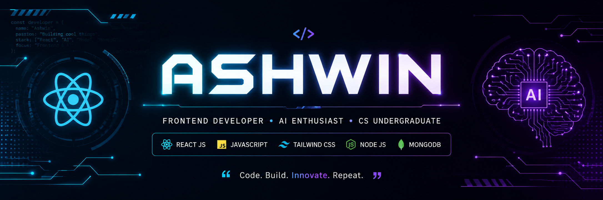

  

<h1 align="center">Hi 👋, I'm Ashwin</h1>

<h3 align="center">
Frontend Developer • React JS • AI Enthusiast • CS Undergraduate
</h3>

  

---

# 🚀 About Me

- 🎓 Computer Science Undergraduate
- 💻 Frontend Developer focused on modern UI/UX
- 🤖 Interested in AI-powered applications
- ⚡ Building impactful real-world projects
- 🌱 Currently learning Full Stack Development & AI Integration

---

# 🛠️ Tech Stack

  

---

# 📊 GitHub Stats

  

  

---

# 🏆 GitHub Trophies

  

---

# 🌟 Featured Projects

## 🍎 Calorix

AI-powered calorie tracking and health assistant designed to help users monitor nutrition with intelligent food analysis and modern UI.

### 🚀 Features

- Smart calorie tracking
- AI-powered food analysis
- Personalized health dashboard
- Gemini AI integration
- Responsive modern UI
- Real-time user interaction

### 🛠️ Tech Stack

- React JS
- Tailwind CSS
- Gemini API
- Vercel

### 🌐 Live Demo

https://calorix-taupe.vercel.app/

---

## 🏎️ F1 Pitwall

Modern Formula 1 dashboard inspired by real-time race engineering systems and telemetry interfaces.

### 🚀 Features

- F1-inspired UI design
- Interactive dashboard experience
- Responsive layouts
- Racing telemetry aesthetics
- Modern frontend animations

### 🛠️ Tech Stack

- React JS
- Tailwind CSS
- JavaScript
- Vercel

### 🌐 Live Demo

https://f1-pitwall-six.vercel.app/

---

# 🌐 Connect With Me

---

# 🐍 Contribution Snake

  

---

# ✨ Random Dev Quote

  

---

  

⭐ Building modern frontend experiences with React & AI

